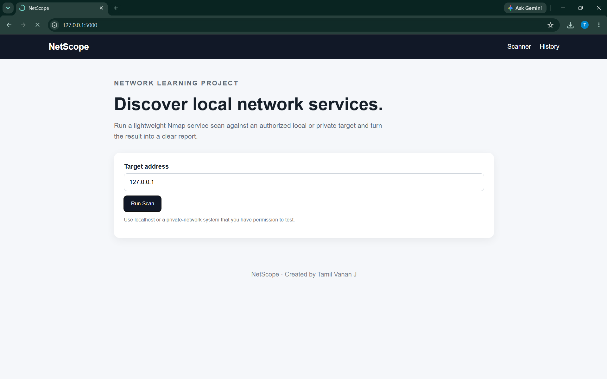
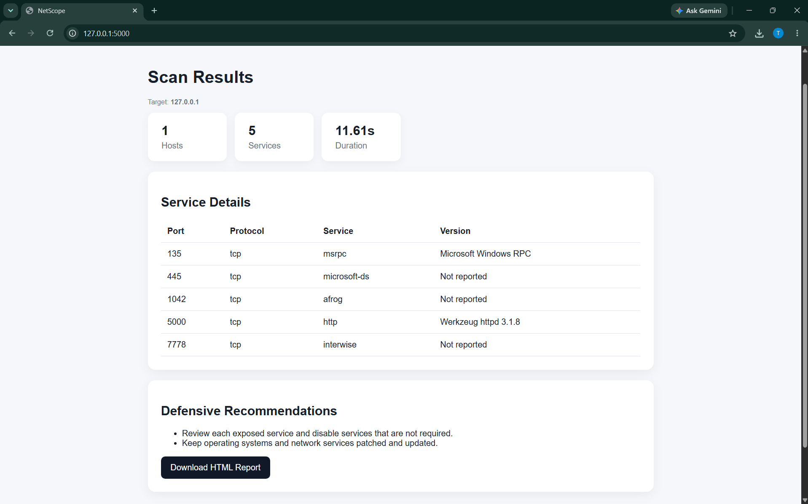
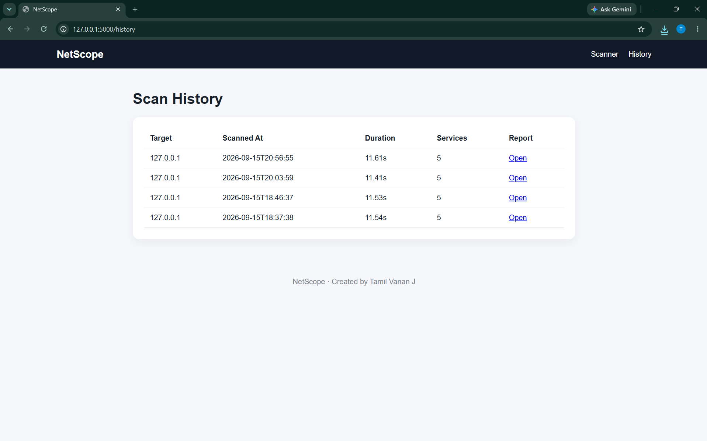

# NetScope — Local Network Service Reporter

A beginner-friendly Flask web application for discovering network services on localhost and private networks.

**Author:** Tamil Vanan J

---

## 📌 Overview

NetScope is a defensive network-service discovery tool built with Python and Flask.

It uses Nmap to identify reachable services on authorized local or private-network targets and presents the results through a simple web interface.

The application is designed for learning about:

- Network service discovery
- Open ports and protocols
- Service and version detection
- Defensive security recommendations
- SQLite database storage
- HTML report generation
- Flask web application development

---

## ✨ Features

- ✅ Local and private target validation
- 🔎 Nmap service discovery
- 🔌 Open-port summary
- 🧩 Service and version information
- ⏱️ Scan duration measurement
- 🛡️ Defensive security recommendations
- 🗄️ SQLite scan history
- 📄 HTML report generation
- 🌐 Simple Flask web interface
- 🚫 Rejects invalid/public targets

---

## 🛠️ Technology Stack

| Technology | Purpose |
|---|---|
| Python | Application development |
| Flask | Web application framework |
| Nmap | Network service discovery |
| python-nmap | Python interface for Nmap |
| SQLite | Scan history database |
| HTML | Web pages and reports |
| CSS | User interface styling |
| Jinja2 | Flask templates |

---

## 📋 Requirements

Before running NetScope, install:

- Python 3.10 or newer
- Nmap
- Git
- A modern web browser

Nmap must be installed and available from the terminal.

You can verify Nmap with:

```bash
nmap --version

## Screenshots

### Home Page



### Scan Results



### Scan History

